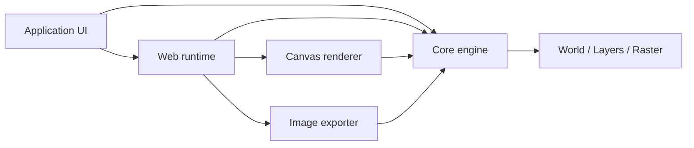

<p align="center">
  
</p>

<h1 align="center">Rêverie</h1>

<p align="center">
  English · <a href="./README.zh.md">简体中文</a>
</p>

<p align="center">
  <strong>A TypeScript raster painting engine for browser-based creative tools.</strong>
</p>

<p align="center">
  Build your own canvas experience with independent drawing models, renderers, and browser runtime.
</p>

<p align="center">
  <a href="#what-is-this">Overview</a> ·
  <a href="#quick-start">Quick Start</a> ·
  <a href="#packages">Packages</a> ·
  <a href="#documentation">Documentation</a>
</p>

<p align="center">
  <a href="./LICENSE"></a>
  
  
  
</p>

## What is this?

Rêverie is a raster painting engine for drawing, annotation, and lightweight image-editing experiences. It handles continuous strokes, sparse pixels, layers, selections, history, Canvas presentation, and image export; your application retains its own interface, workflow, and product rules.

It is for teams that need a custom canvas without assembling drawing infrastructure from scratch, and for TypeScript applications that want to begin with a browser facade before taking control of rendering or document models.

## Preview

<!-- TODO: Place an approved screenshot or <=10-second GIF of the React drawing workspace below. It should show a brush stroke, layers, and one export action. -->

The repository includes a React + Vite demo with drawing, pan and zoom, layers, selections, undo/redo, image brushes, and PNG/JPEG/WebP export. Run `pnpm dev` to explore it locally.

## Why?

Native Canvas can draw pixels, but it does not provide a coherent model for continuous strokes, sparse large canvases, layer documents, undo history, zoomed presentation, and export. When these concerns are folded into UI code, event handlers, and rendering loops, product logic becomes hard to replace and test.

Rêverie separates the persistent drawing model from platform capabilities: `core` has no browser dependency; rendering, export, and input runtime are independent; `web` then composes them into a ready-to-use canvas experience. This lets applications integrate quickly, then take lower-level control when they need it.

## Features

<table>
  <tr>
    <td width="50%">
      <h3>◌ Sparse document model</h3>
      <p>Pixels are stored in Tiles on demand. <code>World</code> manages ordered layers, opacity, visibility, and finite or infinite paint bounds.</p>
    </td>
    <td width="50%">
      <h3>✦ Deterministic strokes</h3>
      <p>Circle, pixel, and image brushes share one stroke pipeline, with pressure, velocity, direction, tilt, and reproducible random variation.</p>
    </td>
  </tr>
  <tr>
    <td width="50%">
      <h3>◫ Browser-ready canvas</h3>
      <p>The browser runtime handles Pointer Events, coordinate conversion, frame-budgeted scheduling, responsive sizing, and one history entry per stroke.</p>
    </td>
    <td width="50%">
      <h3>↗ Independent export</h3>
      <p>Screen rendering and world-coordinate export are separate, so a zoomed preview never rewrites source pixels or changes PNG, JPEG, or WebP output.</p>
    </td>
  </tr>
</table>

## Architecture

An application can use the platform-independent model alone, or add the browser runtime for an interactive canvas. Rendering and export share document state without depending on one another.



## How it works

| Stage      | Responsibility                                                                                                                 |
| ---------- | ------------------------------------------------------------------------------------------------------------------------------ |
| 1. Input   | The browser runtime normalizes pointer input into continuous strokes and runs drawing commands within a frame budget.          |
| 2. Paint   | The core resamples strokes into stamps and writes the active layer's sparse RGBA Raster; selection and history apply here.     |
| 3. Present | The Canvas renderer displays the current Camera view, while the exporter composites a world-space region and encodes an image. |

## Quick Start

In an existing browser project, install the Web facade:

```bash
pnpm add @reverie/web
```

To run the included demo from the repository root:

```bash
pnpm install
pnpm dev
```

For a browser project, `ReverieCanvas` is the shortest integration path:

```ts
import { ReverieCanvas } from "@reverie/web";

const canvas = document.querySelector("canvas");

if (!(canvas instanceof HTMLCanvasElement)) {
  throw new Error("A canvas element is required.");
}

const reverie = new ReverieCanvas({
  canvas,
  width: 1024,
  height: 768,
});

// Pointer input and responsive sizing are attached automatically.
```

`ReverieCanvas` owns its Session and Renderer, including their cleanup. Do not
dispose `reverie.session` or `reverie.renderer` independently. Applications using
`CanvasRenderer` directly own it and must call `renderer.dispose()`. After direct
World or Raster changes, call `renderer.markSourceChanged()` (or `invalidate()`
for a full reset) before rendering; the Web facade handles its drawing path.

For high-frequency camera input, update the public Camera and request one
animation-frame render. Request full quality when the gesture ends:

```ts
reverie.camera.panBy(2, 0);
reverie.requestViewRender("interactive");

// On pointer release or after wheel input becomes idle:
reverie.requestViewRender("full");

// When the owning view unmounts:
reverie.dispose();
```

`reverie.render()` remains synchronous. `renderer.diagnostics.getSnapshot()`
reports coalesced view requests, interaction quality, and visible, warm, and
retained renderer results. Its `reuse` counters report provisional presentations,
presentation and generation reuse hits, and visible and warm misses. Camera
changes do not change document data.

Camera prefetch uses a bounded screen-space margin that grows in Tile count as
zoom decreases. During interactive panning, recent Camera movement prioritizes
a forward warm strip after visible rendering; settled `full` renders refine the
visible area at full quality. The diagnostic snapshot's `coverage` section
reports the current margins, velocity, lookahead, pressure, interactive output
size, and cumulative prefetch work. These tuning values are internal and may
change between releases.

The Web scheduler passes `remainingFrameBudgetMs` to Canvas renders as an
advisory warm-work admission hint. A deferred warm continuation remains pending
for a later frame. Canvas diagnostics also report RGBA identity hits, fallback
comparison calls and bytes, completion drawing deltas, and warm executions and
deferrals. Published `RenderRegion.pixels` buffers must not be modified in place.

Stage timings can be collected only while a diagnostics view is open:

```ts
reverie.renderer.configureDiagnostics({ timings: true });
// When the diagnostics view closes:
reverie.renderer.configureDiagnostics({ timings: false });
```

Each change starts a fresh timing window; render counters remain available.

Requires Node.js `^22.12.0`, `^24.0.0`, or `>=26.0.0`, and pnpm `11.18.0`.

## Examples

| Example                                             | What it demonstrates                                                                     |
| --------------------------------------------------- | ---------------------------------------------------------------------------------------- |
| [React drawing workspace](./demo)                   | Fixed-size canvases, brush settings, pan and zoom, selections, layers, and image export. |
| [Browser facade](./web/src/facade/ReverieCanvas.ts) | One canvas runtime that composes input, scheduling, rendering, history, and downloads.   |
| [Core integration tests](./test/integration)        | Executable examples of stroke, document, layer, selection, and pixel behavior.           |

## Packages

| Package                                                   | Responsibility                                                                                        |
| --------------------------------------------------------- | ----------------------------------------------------------------------------------------------------- |
| [`@reverie/core`](./core)                                 | Platform-independent world, layers, sparse pixels, brushes, strokes, selections, and document models. |
| [`@reverie/canvas-renderer`](./renderers/canvas-renderer) | Presents the active Camera view with HTML Canvas and maintains a LOD cache for zoomed-out views.      |
| [`@reverie/web`](./web)                                   | Browser input, drawing scheduling, history, canvas facade, and download capabilities.                 |
| [`@reverie/exporter`](./exporter)                         | World-region composition plus PNG, JPEG, and WebP encoding.                                           |
| [`@reverie/demo`](./demo)                                 | Browser example application built with React and Vite.                                                |
| [`@reverie/test`](./test)                                 | Vitest integration tests for core behavior.                                                           |

## Built with

TypeScript · Node.js · pnpm workspaces · HTML Canvas · React · Vite · Vitest · Playwright

## Documentation

This README stays at the project-introduction level and does not duplicate the API reference. The typed entry points are the source of truth for complete interfaces: [`core`](./core/index.ts), [`canvas-renderer`](./renderers/canvas-renderer/index.ts), [`web`](./web/index.ts), and [`exporter`](./exporter/index.ts). A standalone documentation site is in preparation.

## Development

```bash
# Start the demo and package watchers
pnpm dev

# Validate the workspace
pnpm typecheck
pnpm test
pnpm build
```

The repository uses pnpm workspaces. Do not create lockfiles with npm or Yarn.

## License

Released under the [Apache License 2.0](./LICENSE).
