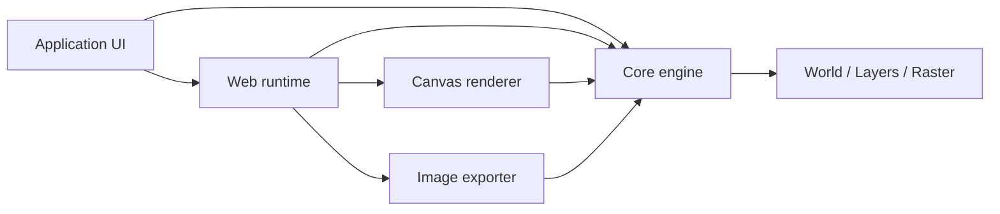

<!-- TODO: Add an approved Rêverie logo and a 16:9 editor screenshot or short demo GIF. No suitable visual asset is currently tracked in this repository. -->

<h1 align="center">Rêverie</h1>

<p align="center">
  <strong>为浏览器创作工具构建的 TypeScript 位图绘制引擎。</strong>
</p>

<p align="center">
  用独立的绘制模型、渲染器和浏览器运行时，构建属于你自己的画布体验。
</p>

<p align="center">
  <a href="#what-is-this">Overview</a> ·
  <a href="#quick-start">Quick Start</a> ·
  <a href="#packages">Packages</a> ·
  <a href="#documentation">Documentation</a>
</p>

<p align="center">
  <a href="./LICENSE"></a>
  
  
  
</p>

## What is this?

Rêverie 是一个面向绘图、标注和轻量图像编辑体验的位图绘制引擎。它处理连续笔触、稀疏像素、图层、选区、历史记录、Canvas 呈现和图片导出；应用则保有自己的界面、工作流与产品规则。

它适合需要自定义画布而不想从零拼装绘制基础设施的团队，也适合希望从浏览器门面逐步下沉到渲染或文档模型的 TypeScript 应用。

## Preview

<!-- TODO: Place an approved screenshot or <=10-second GIF of the React drawing workspace below. It should show a brush stroke, layers, and one export action. -->

仓库内置 React + Vite 演示应用，覆盖绘制、平移缩放、图层、选区、撤销/重做、图像笔刷和 PNG/JPEG/WebP 导出。运行 `pnpm dev` 即可查看。

## Why?

原生 Canvas 能画像素，却不提供连续笔触、稀疏大画布、图层文档、撤销历史、缩放显示和导出的协同模型。把这些能力分别塞进 UI、事件处理和渲染循环，往往会使产品逻辑难以替换和测试。

Rêverie 将持久的绘制模型与平台能力分开：`core` 不依赖浏览器；渲染、导出和输入运行时各自独立；`web` 再组合出可直接接入的画布体验。这个取舍让应用可以先快速集成，再在需要时接管更低层的控制。

## Features

<table>
  <tr>
    <td width="50%">
      <h3>◌ Sparse document model</h3>
      <br />
      <p>像素按 Tile 按需保存。<code>World</code> 管理有序图层、透明度、可见性和有限或无限的绘制边界。</p>
    </td>
    <td width="50%">
      <h3>✦ Deterministic strokes</h3>
      <br />
      <p>圆形、像素和图像笔刷走同一笔触管线，并支持压力、速度、方向、倾角及可复现的随机变化。</p>
    </td>
  </tr>
  <tr>
    <td width="50%">
      <h3>◫ Browser-ready canvas</h3>
      <br />
      <p>浏览器运行时处理 Pointer Events、坐标转换、按帧调度、响应式尺寸和每笔一次的历史记录。</p>
    </td>
    <td width="50%">
      <h3>↗ Independent export</h3>
      <br />
      <p>屏幕渲染与世界坐标导出分离；缩放预览不会改写源像素或影响 PNG、JPEG、WebP 输出。</p>
    </td>
  </tr>
</table>

## Architecture

应用可以只使用平台无关的核心模型，也可以接入浏览器运行时获得交互式画布。渲染和导出共享同一份文档状态，但彼此不耦合。



## How it works

| Stage      | Responsibility                                                                        |
| ---------- | ------------------------------------------------------------------------------------- |
| 1. Input   | 浏览器运行时将指针输入归一化为连续笔触，并按帧预算执行绘制命令。                      |
| 2. Paint   | 核心包将笔触重采样为 stamps，写入当前图层的稀疏 RGBA Raster；选区与历史记录在此生效。 |
| 3. Present | Canvas 渲染器按 Camera 显示当前视图；导出器则在世界坐标中合成指定区域并编码图片。     |

## Quick Start

在仓库根目录安装依赖并启动包含的演示应用：

```bash
pnpm install
pnpm dev
```

在浏览器项目中，`ReverieCanvas` 是最短的接入路径：

```ts
import { ReverieCanvas } from "@reverie/web";

const canvas = document.querySelector("canvas");

if (!(canvas instanceof HTMLCanvasElement)) {
  throw new Error("A canvas element is required.");
}

const reverie = new ReverieCanvas({
  canvas,
  width: 1024,
  height: 768,
});

// Pointer input is attached automatically. Dispose when the owning view unmounts.
```

需要 Node.js `^22.12.0`、`^24.0.0` 或 `>=26.0.0`，以及 pnpm `11.18.0`。

## Examples

| Example                                             | What it demonstrates                                     |
| --------------------------------------------------- | -------------------------------------------------------- |
| [React drawing workspace](./demo)                   | 固定尺寸画布、笔刷设置、平移缩放、选区、图层和图片导出。 |
| [Browser facade](./web/src/facade/ReverieCanvas.ts) | 将输入、调度、渲染、历史与下载组合为一个画布运行时。     |
| [Core integration tests](./test/integration)        | 笔触、文档、图层、选择与像素行为的可执行示例。           |

## Packages

| Package                           | Responsibility                                                 |
| --------------------------------- | -------------------------------------------------------------- |
| [`@reverie/core`](./core)         | 平台无关的世界、图层、稀疏像素、笔刷、笔触、选区与文档模型。   |
| [`@reverie/renderer`](./renderer) | 以 HTML Canvas 呈现当前 Camera 视图，并维护缩小时的 LOD 缓存。 |
| [`@reverie/web`](./web)           | 浏览器输入、绘制调度、历史记录、画布门面和下载能力。           |
| [`@reverie/exporter`](./exporter) | 世界区域合成，以及 PNG、JPEG、WebP 编码。                      |
| [`@reverie/demo`](./demo)         | 使用 React + Vite 构建的浏览器示例应用。                       |
| [`@reverie/test`](./test)         | 核心行为的 Vitest 集成测试。                                   |

## Built with

TypeScript · Node.js · pnpm workspaces · HTML Canvas · React · Vite · Vitest · Playwright

## Documentation

README 保持在项目介绍层面，不重复维护 API Reference。完整接口以各 package 的 typed entry point 为准：[`core`](./core/index.ts)、[`renderer`](./renderer/index.ts)、[`web`](./web/index.ts) 和 [`exporter`](./exporter/index.ts)。独立文档站正在准备中。

## Development

```bash
# Start the demo and package watchers
pnpm dev

# Validate the workspace
pnpm typecheck
pnpm test
pnpm build
```

仓库使用 pnpm workspace 管理；请勿使用 npm 或 Yarn 生成锁文件。

## License

Released under the [Apache License 2.0](./LICENSE).
