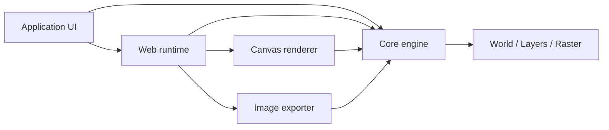

<p align="center">
  
</p>

<h1 align="center">Rêverie</h1>

<p align="center">
  <a href="./README.md">English</a> · 简体中文
</p>

<p align="center">
  <strong>为浏览器创作工具构建的 TypeScript 位图绘制引擎。</strong>
</p>

<p align="center">
  用独立的绘制模型、渲染器和浏览器运行时，构建属于你自己的画布体验。
</p>

<p align="center">
  <a href="#这是什么">概览</a> ·
  <a href="#快速开始">快速开始</a> ·
  <a href="#软件包">软件包</a> ·
  <a href="#文档">文档</a>
</p>

<p align="center">
  <a href="./LICENSE"></a>
  
  
  
</p>

## 这是什么？

Rêverie 是一个面向绘图、标注和轻量图像编辑体验的位图绘制引擎。它处理连续笔触、稀疏像素、图层、选区、历史记录、Canvas 呈现和图片导出；应用则保有自己的界面、工作流与产品规则。

它适合需要自定义画布而不想从零拼装绘制基础设施的团队，也适合希望从浏览器门面逐步下沉到渲染或文档模型的 TypeScript 应用。

## 预览

<!-- TODO：在下方放置已获批准的 React 绘制工作区截图或不超过 10 秒的 GIF，展示笔触、图层和一次导出操作。 -->

仓库内置 React + Vite 演示应用，覆盖绘制、平移缩放、图层、选区、撤销/重做、图像笔刷和 PNG/JPEG/WebP 导出。运行 `pnpm dev` 即可查看。

## 为什么？

原生 Canvas 能画像素，却不提供连续笔触、稀疏大画布、图层文档、撤销历史、缩放显示和导出的协同模型。把这些能力分别塞进 UI、事件处理和渲染循环，往往会使产品逻辑难以替换和测试。

Rêverie 将持久的绘制模型与平台能力分开：`core` 不依赖浏览器；渲染、导出和输入运行时各自独立；`web` 再组合出可直接接入的画布体验。这个取舍让应用可以先快速集成，再在需要时接管更低层的控制。

## 核心能力

<table>
  <tr>
    <td width="50%">
      <h3>◌ 稀疏文档模型</h3>
      <p>像素按 Tile 按需保存。<code>World</code> 管理有序图层、透明度、可见性和有限或无限的绘制边界。</p>
    </td>
    <td width="50%">
      <h3>✦ 确定性笔触</h3>
      <p>圆形、像素和图像笔刷走同一笔触管线，并支持压力、速度、方向、倾角及可复现的随机变化。</p>
    </td>
  </tr>
  <tr>
    <td width="50%">
      <h3>◫ 浏览器画布运行时</h3>
      <p>浏览器运行时处理 Pointer Events、坐标转换、按帧调度、响应式尺寸和每笔一次的历史记录。</p>
    </td>
    <td width="50%">
      <h3>↗ 独立导出</h3>
      <p>屏幕渲染与世界坐标导出分离；缩放预览不会改写源像素或影响 PNG、JPEG、WebP 输出。</p>
    </td>
  </tr>
</table>

## 架构

应用可以只使用平台无关的核心模型，也可以接入浏览器运行时获得交互式画布。渲染和导出共享同一份文档状态，但彼此不耦合。



## 工作方式

| 阶段    | 职责                                                                                  |
| ------- | ------------------------------------------------------------------------------------- |
| 1. 输入 | 浏览器运行时将指针输入归一化为连续笔触，并按帧预算执行绘制命令。                      |
| 2. 绘制 | 核心包将笔触重采样为 stamps，写入当前图层的稀疏 RGBA Raster；选区与历史记录在此生效。 |
| 3. 呈现 | Canvas 渲染器按 Camera 显示当前视图；导出器则在世界坐标中合成指定区域并编码图片。     |

## 快速开始

在仓库根目录安装依赖并启动包含的演示应用：

```bash
pnpm install
pnpm dev
```

在浏览器项目中，`ReverieCanvas` 是最短的接入路径：

```ts
import { ReverieCanvas } from "@reveriejs/web";

const canvas = document.querySelector("canvas");

if (!(canvas instanceof HTMLCanvasElement)) {
  throw new Error("A canvas element is required.");
}

const reverie = new ReverieCanvas({
  canvas,
  width: 1024,
  height: 768,
});

// Pointer 输入会自动绑定；所属视图卸载时调用 dispose。
```

对于高频 Camera 输入，更新公开的 Camera，并请求一次动画帧渲染；手势结束时再请求完整质量：

```ts
reverie.camera.panBy(2, 0);
reverie.requestViewRender("interactive");

// 松开指针或滚轮输入停止后：
reverie.requestViewRender("full");
```

`reverie.render()` 仍为同步调用。`renderer.diagnostics.getSnapshot()` 会报告合并后的视图请求、交互质量，以及可见、预热和保留的渲染结果。其 `reuse` 计数器记录临时呈现、呈现与生成结果的复用命中，以及可见区域与预热区域的未命中。Camera 变化不会修改文档数据。

Camera 预取使用有界的屏幕空间边距；缩小时，该边距覆盖的 Tile 数量会增加。交互式平移时，最近的 Camera 移动方向决定可见区域渲染后前方预热区域的优先级；平移结束后的 `full` 渲染会以完整质量细化可见区域。诊断快照的 `coverage` 部分报告当前边距、速度、前瞻距离、压力、交互输出尺寸和累计预取工作量。这些调优值属于内部实现，可能随版本变化。

Web 调度器向 Canvas 渲染传入 `remainingFrameBudgetMs`，作为预热工作的建议性准入提示。延后的预热续任务会保留到后续帧。Canvas 诊断还报告 RGBA 标识命中、回退比较的次数与字节数、完成绘制的增量，以及预热任务的执行与延后次数。已发布的 `RenderRegion.pixels` 缓冲区不得原地修改。

只在诊断视图打开时收集各阶段耗时：

```ts
reverie.renderer.configureDiagnostics({ timings: true });
// 诊断视图关闭时：
reverie.renderer.configureDiagnostics({ timings: false });
```

每次切换都会开始新的耗时统计窗口；渲染计数器仍然可用。

需要 Node.js `^22.12.0`、`^24.0.0` 或 `>=26.0.0`，以及 pnpm `11.18.0`。

## 示例

| 示例                                            | 展示内容                                                 |
| ----------------------------------------------- | -------------------------------------------------------- |
| [React 绘制工作区](./demo)                      | 固定尺寸画布、笔刷设置、平移缩放、选区、图层和图片导出。 |
| [浏览器门面](./web/src/facade/ReverieCanvas.ts) | 将输入、调度、渲染、历史与下载组合为一个画布运行时。     |
| [Core 集成测试](./test/integration)             | 笔触、文档、图层、选择与像素行为的可执行示例。           |

## 软件包

| 包                                                        | 职责                                                           |
| --------------------------------------------------------- | -------------------------------------------------------------- |
| [`@reveriejs/core`](./core)                                 | 平台无关的世界、图层、稀疏像素、笔刷、笔触、选区与文档模型。   |
| [`@reveriejs/canvas-renderer`](./renderers/canvas-renderer) | 以 HTML Canvas 呈现当前 Camera 视图，并维护缩小时的 LOD 缓存。 |
| [`@reveriejs/web`](./web)                                   | 浏览器输入、绘制调度、历史记录、画布门面和下载能力。           |
| [`@reveriejs/exporter`](./exporter)                         | 世界区域合成，以及 PNG、JPEG、WebP 编码。                      |
| [`@reveriejs/demo`](./demo)                                 | 使用 React + Vite 构建的浏览器示例应用。                       |
| [`@reveriejs/test`](./test)                                 | 核心行为的 Vitest 集成测试。                                   |

## 技术栈

TypeScript · Node.js · pnpm workspaces · HTML Canvas · React · Vite · Vitest · Playwright

## 文档

README 保持在项目介绍层面，不重复维护 API Reference。完整接口以各 package 的类型化入口为准：[`core`](./core/index.ts)、[`canvas-renderer`](./renderers/canvas-renderer/index.ts)、[`web`](./web/index.ts) 和 [`exporter`](./exporter/index.ts)。独立文档站正在准备中。

## 开发

```bash
# 启动 demo 与各 package 的 watcher
pnpm dev

# 校验 workspace
pnpm typecheck
pnpm test
pnpm build
```

仓库使用 pnpm workspace 管理；请勿使用 npm 或 Yarn 生成锁文件。

## 许可证

使用 [Apache License 2.0](./LICENSE) 发布。
